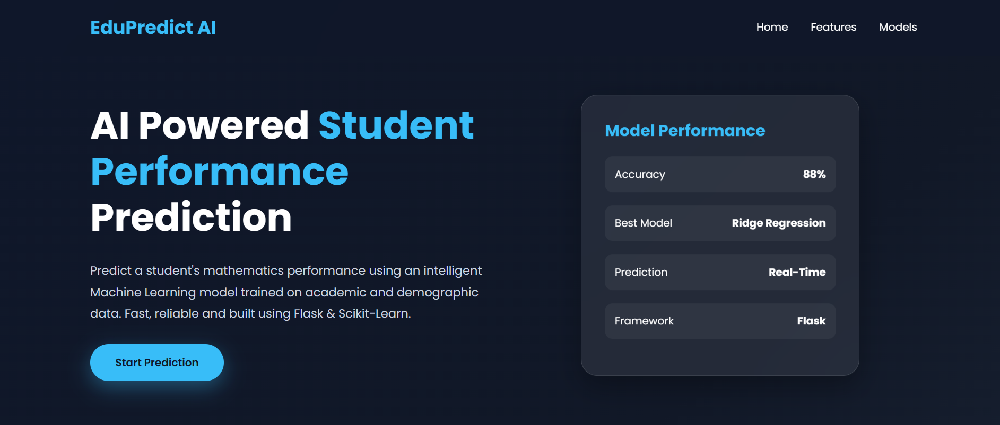
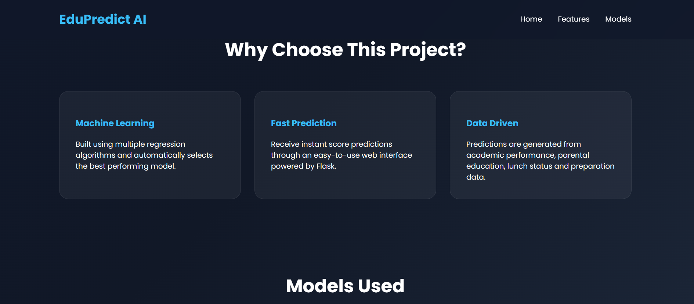
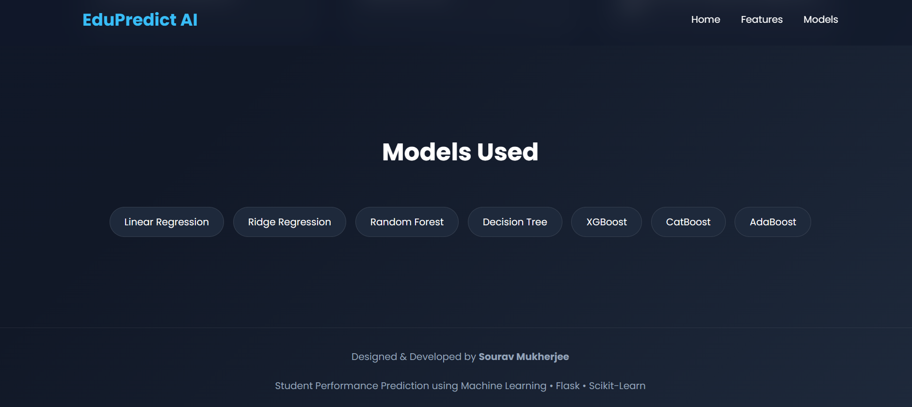
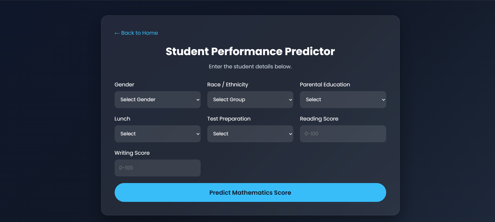

# 🎓 Student Performance Predictor

<div align="center">


### Predict students' mathematics scores using Machine Learning and a modern Flask web application.

</div>

---

# 📖 Overview

Student Performance Predictor is an end-to-end Machine Learning web application that predicts a student's **Mathematics Score** based on various academic and demographic factors.

The project demonstrates a complete Machine Learning workflow—from data preprocessing and model training to deployment on AWS Elastic Beanstalk using Flask.

---

# 🚀 Features

- 🎯 Predicts Mathematics Score
- 📊 User-friendly Flask web interface
- 🤖 Trained using Scikit-Learn
- ⚡ Data preprocessing pipeline
- 🌐 AWS Elastic Beanstalk Deployment
- 📱 Responsive UI
- 🔥 Fast predictions

---

# 📂 Project Structure

```
Student-Performance-Predictor
│
├── artifacts/
│   ├── model.pkl
│   └── preprocessor.pkl
│
├── notebook/
│
├── src/
│   ├── components/
│   ├── pipeline/
│   ├── exception.py
│   ├── logger.py
│   └── utils.py
│
├── templates/
│   ├── index.html
│   └── form.html
│
├── app.py
├── requirements.txt
├── Procfile
├── setup.py
└── README.md
```

---

# 🧠 Machine Learning Workflow

The project follows a complete ML pipeline:

- Data Ingestion
- Data Validation
- Data Transformation
- Feature Engineering
- Model Training
- Model Evaluation
- Model Selection
- Prediction Pipeline
- Flask Deployment
- AWS Deployment

---

# 📋 Input Features

The prediction model uses the following inputs:

| Feature | Description |
|----------|-------------|
| Gender | Male / Female |
| Race/Ethnicity | Group A-E |
| Parental Education | Parent's education level |
| Lunch | Standard / Free or Reduced |
| Test Preparation | Completed / None |
| Reading Score | Reading marks |
| Writing Score | Writing marks |

---

# 🎯 Output

The model predicts:

> **Mathematics Score**

---

# 🤖 Models Evaluated

The following regression algorithms were trained and compared:

- Linear Regression
- Ridge Regression
- Lasso Regression
- K-Nearest Neighbors Regressor
- Decision Tree Regressor
- Random Forest Regressor
- AdaBoost Regressor
- Gradient Boosting Regressor
- CatBoost Regressor
- XGBoost Regressor

---

# 🏆 Best Model

**Linear Regression**

**R² Score:** **0.8804**

---

# 🛠️ Technologies Used

### Backend

- Python
- Flask

### Machine Learning

- Scikit-Learn
- Pandas
- NumPy

### Deployment

- AWS Elastic Beanstalk
- Gunicorn

### Version Control

- Git
- GitHub

---

# ⚙️ Installation

Clone the repository

```bash
git clone https://github.com/YOUR_USERNAME/Student-Performance-Predictor.git
```

Move into the project directory

```bash
cd Student-Performance-Predictor
```

Create virtual environment

```bash
python -m venv venv
```

Activate environment

Windows

```bash
venv\Scripts\activate
```

Linux/Mac

```bash
source venv/bin/activate
```

Install dependencies

```bash
pip install -r requirements.txt
```

---

# ▶️ Run Locally

```bash
python app.py
```

Open your browser

```
http://127.0.0.1:5000
```

---

# ☁️ AWS Deployment

The application is deployed using:

- AWS Elastic Beanstalk
- Gunicorn
- Python 3.11
- Amazon Linux 2023

Deploy updates using:

```bash
eb deploy
```

Check status:

```bash
eb status
```

View logs:

```bash
eb logs
```

---

# 📊 Dataset

The project uses the **Student Performance Dataset**, containing student demographic information and examination scores.

Target Variable:

- Mathematics Score

---

## 📸 Application Screenshots

### 🏠 Home Page

<p align="center">
  
</p>

---

### ✨ Features Section

<p align="center">
  
</p>

---

### 🤖 Models Evaluated

<p align="center">
  
</p>

---

### 📝 Prediction Form

<p align="center">
  
</p>
# 🔮 Future Improvements

- User authentication
- Prediction history
- Interactive dashboards
- REST API
- Docker support
- CI/CD Pipeline
- Model monitoring
- Cloud database integration

---

# 👨‍💻 Author

**Sourav Mukherjee**

B.Tech CSE (AI & ML)

Amity University Jharkhand

GitHub: https://github.com/Souravs-Codes

LinkedIn: *(Add your LinkedIn profile)*

---

# ⭐ Support

If you found this project helpful, consider giving it a **⭐ Star** on GitHub.

It motivates me to build more Machine Learning projects and share them with the community.

---

<div align="center">

### 🚀 Built with Python, Flask, Scikit-Learn & AWS

**Happy Coding! ❤️**

</div>
